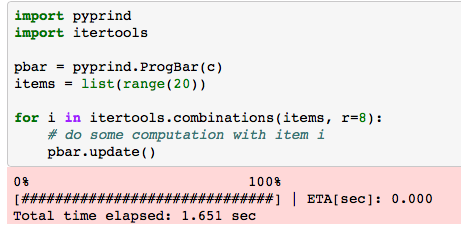

mlxtend  
Sebastian Raschka, last updated: 05/14/2015

# Permutations

> from mlxtend.math import num_permutations

Functions to calculate the number of permutations for creating subsequences of *r* elements out of a sequence with *n* elements.

## Example

In:

	from mlxtend.math import num_permutations

	d = num_permutations(n=20, r=8, with_replacement=False)
	print('Number of ways to permute 20 elements into 8 subelements: %d' % d)

Out:	

	Number of ways to permute 20 elements into 8 subelements: 5079110400

This is especially useful in combination with [`itertools`](https://docs.python.org/3/library/itertools.html), e.g., in order to estimate the progress via [`pyprind`](https://github.com/rasbt/pyprind).
    
    

## Default Parameters

    def num_permutations(n, r, with_replacement=False):
        """ 
        Function to calculate the number of possible permutations.
        
        Parameters
        ----------
        n : `int`
          Total number of items.
    
        r : `int`
          Number of elements of the target itemset.
    
        with_replacement : `bool`, optional, (default=False)
          Allows repeated elements if True.
      
        Returns
        ----------
        permut : `int`
          Number of possible permutations.
        
        """
