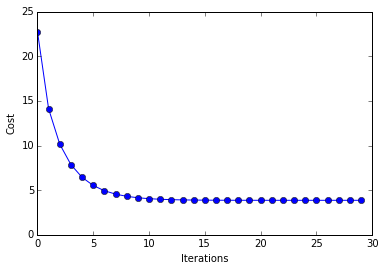

mlxtend
Sebastian Raschka, last updated: 05/14/2015

# Adaline

> from mlxtend.classifier import Adaline

Implementation of Adaline (Adaptive Linear Neuron; a single-layer artificial neural network) using the Widrow-Hoff delta rule. [2].

[2] B. Widrow, M. E. Hoff, et al. Adaptive switching circuits. 1960.

For more usage examples please see the [IPython Notebook](http://nbviewer.ipython.org/github/rasbt/mlxtend/blob/master/docs/examples/classifier_adaline.ipynb).

A detailed explanation about the Adaline learning algorithm can be found here [Artificial Neurons and Single-Layer Neural Networks
- How Machine Learning Algorithms Work Part 1](http://sebastianraschka.com/Articles/2015_singlelayer_neurons.html).

### Example 1 - Stochastic Gradient Descent

	from mlxtend.data import iris_data
	from mlxtend.evaluate import plot_decision_regions
	from mlxtend.classifier import Adaline
	import matplotlib.pyplot as plt

	# Loading Data

	X, y = iris_data()
	X = X[:, [0, 3]] # sepal length and petal width
	X = X[0:100] # class 0 and class 1
	y = y[0:100] # class 0 and class 1

	# standardize
	X[:,0] = (X[:,0] - X[:,0].mean()) / X[:,0].std()
	X[:,1] = (X[:,1] - X[:,1].mean()) / X[:,1].std()

	ada = Adaline(epochs=30, eta=0.01, learning='sgd', random_seed=1)
	ada.fit(X, y)
	plot_decision_regions(X, y, clf=ada)
	plt.title('Adaline - Stochastic Gradient Descent')
	plt.show()

	plt.plot(range(len(ada.cost_)), ada.cost_, marker='o')
	plt.xlabel('Iterations')
	plt.ylabel('Cost')
	plt.show()

### Default Parameters

<pre>class Adaline(object):
    """ ADAptive LInear NEuron classifier.

    Parameters
    ------------
    eta : float
      Learning rate (between 0.0 and 1.0)

    epochs : int
      Passes over the training dataset.

    learning : str (default: sgd)
      Gradient decent (gd) or stochastic gradient descent (sgd)

    shuffle : bool (default: False)
        Shuffles training data every epoch if True to prevent circles.

    random_seed : int (default: None)
        Set random state for shuffling and initializing the weights.

    zero_init_weight : bool (default: False)
        If True, weights are initialized to zero instead of small random
        numbers in the interval [0,1]

    Attributes
    -----------
    w_ : 1d-array
      Weights after fitting.

    cost_ : list
      Sum of squared errors after each epoch.

    """</pre>

### Methods

<pre>    def fit(self, X, y, init_weights=True):
        """ Fit training data.

        Parameters
        ----------
        X : {array-like, sparse matrix}, shape = [n_samples, n_features]
            Training vectors, where n_samples is the number of samples and
            n_features is the number of features.

        y : array-like, shape = [n_samples]
            Target values.

        init_weights : bool (default: True)
            (Re)initializes weights to small random floats if True.

        Returns
        -------
        self : object
        """</pre>

<pre>    def predict(self, X):
        """
        Predict class labels for X.

        Parameters
        ----------
        X : {array-like, sparse matrix}, shape = [n_samples, n_features]
            Training vectors, where n_samples is the number of samples and
            n_features is the number of features.

        Returns
        ----------
        class : int
          Predicted class label.

        """</pre>

