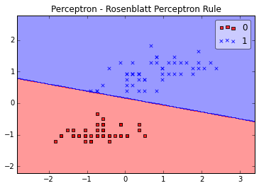
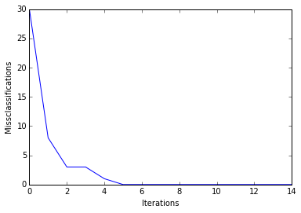

mlxtend  
Sebastian Raschka, 05/14/2015

# Perceptron

Implementation of a Perceptron (single-layer artificial neural network) using the Rosenblatt Perceptron Rule [1].

[1] F. Rosenblatt. The perceptron, a perceiving and recognizing automaton Project Para. Cornell Aeronautical Laboratory, 1957.

For more usage examples please see the [IPython Notebook](http://nbviewer.ipython.org/github/rasbt/mlxtend/blob/master/docs/examples/classifier_perceptron.ipynb).

A detailed explanation about the perceptron learning algorithm can be found here [Artificial Neurons and Single-Layer Neural Networks
- How Machine Learning Algorithms Work Part 1](http://sebastianraschka.com/Articles/2015_singlelayer_neurons.html).

#### Example

	from mlxtend.data import iris_data
	from mlxtend.evaluate import plot_decision_regions
	from mlxtend.classifier import Perceptron
	import matplotlib.pyplot as plt

	# Loading Data

	X, y = iris_data()
	X = X[:, [0, 3]] # sepal length and petal width
	X = X[0:100] # class 0 and class 1
	y = y[0:100] # class 0 and class 1

	# standardize
	X[:,0] = (X[:,0] - X[:,0].mean()) / X[:,0].std()
	X[:,1] = (X[:,1] - X[:,1].mean()) / X[:,1].std()

	# Rosenblatt Perceptron

	ppn = Perceptron(epochs=15, eta=0.01, random_seed=1)
	ppn.fit(X, y)

	plot_decision_regions(X, y, clf=ppn)
	plt.title('Perceptron - Rosenblatt Perceptron Rule')
	plt.show()

	print(ppn.w_)

	plt.plot(range(len(ppn.cost_)), ppn.cost_)
	plt.xlabel('Iterations')
	plt.ylabel('Missclassifications')
	plt.show()

### Default Parameters

<pre>class Perceptron(object):
    """Perceptron classifier.
    
    Parameters
    ------------
    eta : float
      Learning rate (between 0.0 and 1.0)

    epochs : int
      Passes over the training dataset.

    random_state : int
      Random state for initializing random weights.

    Attributes
    -----------
    w_ : 1d-array
      Weights after fitting.

    cost_ : list
      Number of misclassifications in every epoch.

    """</pre>

### Methods

<pre>    def fit(self, X, y, init_weights=True):
        """ Fit training data.

        Parameters
        ----------
        X : {array-like, sparse matrix}, shape = [n_samples, n_features]
            Training vectors, where n_samples is the number of samples and
            n_features is the number of features.

        y : array-like, shape = [n_samples]
            Target values.

        init_weights : bool (default: True)
            (Re)initializes weights to small random floats if True.
            
        shuffle : bool (default: False)
            Shuffles training data every epoch if True to prevent circles.
            
        random_seed : int (default: None)
            Set random state for shuffling and initializing the weights.

        Returns
        -------
        self : object
        
        """</pre>
        
        
        
<pre>    def predict(self, X):
        """ Predict class labels for X.
        
        Parameters
        ----------
        X : {array-like, sparse matrix}, shape = [n_samples, n_features]
            Training vectors, where n_samples is the number of samples and
            n_features is the number of features.
        Returns
        ----------
        class : int
          Predicted class label.
          
        """ </pre>

