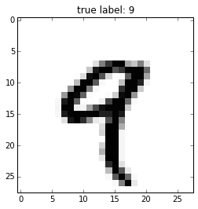

mlxtend  
Sebastian Raschka, last updated: 06/23/2015

# MNIST

> from mlxtend.data import mnist_data

A function that loads 5000 shuffled and labeled training samples from the MNIST (handwritten digits) dataset into NumPy arrays. 

The feature matrix `X` consists of 5000 rows where each row represents the unrolled 784 pixel feature vector of the 28x28 pixel images.  
The unique class labels in `y` are the integers 0-9 corresponding to the respective digits in the feature matrix.

Dataset source: [http://yann.lecun.com/exdb/mnist/](http://yann.lecun.com/exdb/mnist/)

> Y. LeCun and C. Cortes. Mnist handwritten digit database. AT&T Labs [Online]. Available: http://yann. lecun. com/exdb/mnist, 2010.

## Example

	>>> from mlxtend.data import mnist_data
    >>> X, y = mnist_data()
    
Visualizing the images:
    
    >>> import matplotlib.pyplot as plt
    >>> def plot_digit(X, y, idx):
    ...    img = X[idx].reshape(28,28)
    ...    plt.imshow(img, cmap='Greys',  interpolation='nearest')
    ...    plt.title('true label: %d' % y[idx])
    ...    plt.show()
    >>> plot_digit(X, y, 4)   
    

	

    

##Default Parameters

<pre>def mnist_data():
    """5000 samples from the MNIST handwritten digits datast.
    Data Source: http://yann.lecun.com/exdb/mnist/

    Returns
    --------
    X, y : [n_samples, n_features], [n_class_labels]
      X is the feature matrix with 5000 image samples as rows,
      each row consists of 28x28 pixels that were unrolled into
      784 pixel feature vectors.
      y contains the 10 unique class labels 0-9.
      
    """</pre>

