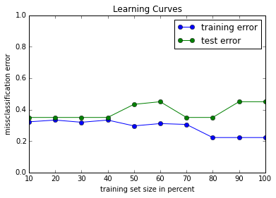

mlxtend  
Sebastian Raschka, last updated: 05/14/2015

# Plotting Learning Curves

> from mlxtend.evaluate import plot_learning_curves

A function to plot learning curves for classifiers. Learning curves are extremely useful to analyze if a model is suffering from over- or under-fitting (high variance or high bias). The function can be imported via

## Example 1 - Training Samples

	from mlxtend.evaluate import plot_learning_curves
	from sklearn import datasets
	from sklearn.cross_validation import train_test_split

	# Loading some example data
	iris = datasets.load_iris()
	X = iris.data
	y = iris.target

	X_train, X_test, y_train, y_test = train_test_split(X, y, train_size=0.6, random_seed=2)

	from sklearn.tree import DecisionTreeClassifier
	import numpy as np

	clf = DecisionTreeClassifier(max_depth=1)

	plot_learning_curves(X_train, y_train, X_test, y_test, clf, kind='training_size')
	plt.show()

	plot_learning_curves(X_train, y_train, X_test, y_test, clf, kind='n_features')
	plt.show()

## Example 2 - Features

	plot_learning_curves(X_train, y_train, X_test, y_test, clf, kind='n_features')
	plt.show()

For more examples, please see this [IPython Notebook](http://nbviewer.ipython.org/github/rasbt/mlxtend/blob/master/docs/examples/evaluate_plot_learning_curves.ipynb)

## Default Parameters

<pre>def plot_learning_curves(X_train, y_train, X_test, y_test, clf, kind='training_size',
            marker='o', scoring='misclassification error', suppress_plot=False, print_model=True):
    """
    Plots learning curves of a classifier.

    Parameters
    ----------
    X_train : array-like, shape = [n_samples, n_features]
      Feature matrix of the training dataset.

    y_train : array-like, shape = [n_samples]
      True class labels of the training dataset.

    X_test : array-like, shape = [n_samples, n_features]
      Feature matrix of the test dataset.

    y_test : array-like, shape = [n_samples]
      True class labels of the test dataset.

    clf : Classifier object. Must have a .predict .fit method.

    kind : str (default: 'training_size')
      'training_size' or 'n_features'
      Plots missclassifications vs. training size or number of features.

    marker : str (default: 'o')
      Marker for the line plot.

    scoring : str (default: 'misclassification error')
      If not 'accuracy', accepts the following metrics (from scikit-learn):
      {'accuracy', 'average_precision', 'f1_micro', 'f1_macro',
      'f1_weighted', 'f1_samples', 'log_loss', 'precision', 'recall', 'roc_auc',
      'adjusted_rand_score', 'mean_absolute_error', 'mean_squared_error',
      'median_absolute_error', 'r2'}

    suppress_plot=False : bool (default: False)
      Suppress matplotlib plots if True. Recommended
      for testing purposes.

    print_model : bool (default: True)
      Print model parameters in plot title if True.

    Returns
    ---------
    (training_error, test_error): tuple of lists
    """</pre>