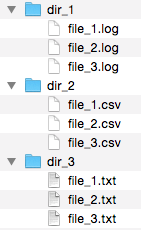

mlxtend  
Sebastian Raschka, 05/14/2015

# Find File Groups

> from mlxtend.file_io import find_filegroups

A function that finds files that belong together (i.e., differ only by file extension) in different directories and collects them in a Python dictionary for further processing tasks. 

## Example

    from mlxtend.file_io import find_filegroups

    d1 = os.path.join(master_path, 'dir_1')
    d2 = os.path.join(master_path, 'dir_2')
    d3 = os.path.join(master_path, 'dir_3')
    
    find_filegroups(paths=[d1,d2,d3], substring='file_1')
    # Returns:
    # {'file_1': ['/Users/sebastian/github/mlxtend/tests/data/find_filegroups/dir_1/file_1.log', 
    #             '/Users/sebastian/github/mlxtend/tests/data/find_filegroups/dir_2/file_1.csv', 
    #             '/Users/sebastian/github/mlxtend/tests/data/find_filegroups/dir_3/file_1.txt']}
    #
    # Note: Setting `substring=''` would return a 
    # dictionary of all file paths for 
    # file_1.*, file_2.*, file_3.*

   
## Default Parameters

    def find_filegroups(paths, substring='', extensions=None, validity_check=True, ignore_invisible=True):
        """
        Function that finds and groups files from different directories in a python dictionary.
        
        Parameters
        ----------
        paths : `list` 
          Paths of the directories to be searched. Dictionary keys are build from
          the first directory.
    
        substring : `str`, optional, (default=`''`)
          Substring that all files have to contain to be considered.
    
        extensions : `list`, optional, (default=`None`)
          `None` or `list` of allowed file extensions for each path. If provided, the number
          of extensions must match the number of `paths`.
         
        validity_check : `bool`, optional, (default=`True`)
          If `True`, checks if all dictionary values have the same number of file paths. Prints
          a warning and returns an empty dictionary if the validity check failed.

        ignore_invisible : `bool`, optional, (default=`True`)
          If `True`, ignores invisible files (i.e., files starting with a period).

        Returns
        ----------
        groups : `dict`
          Dictionary of files paths. Keys are the file names found in the first directory listed
          in `paths` (without file extension).
        
        """

 
 
 
 
