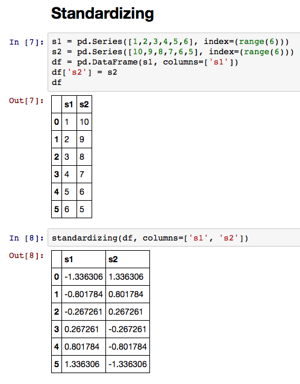

mlxtend  
Sebastian Raschka, last updated: 06/02/2015

# Standardizing

> from mlxtend.preprocessing import standardizing

A function to standardize columns in pandas DataFrames (or NumPy arrays) so that they have properties of a standard normal distribution (mean=0, standard deviation=1).

## Example

	from mlxtend.pandas import standardizing

    

## Default Parameters

<pre>def standardizing(array, columns, ddof=0):
    """
    Standardizing columns in pandas DataFrames.

    Parameters
    ----------
    array : pandas DataFrame or NumPy ndarray, shape = [n_rows, n_columns].

    columns : array-like, shape = [n_columns]
      Array-like with column names, e.g., ['col1', 'col2', ...]
      or column indices [0, 2, 4, ...]
      
    ddof : int (default: 0)
      Delta Degrees of Freedom. The divisor used in calculations 
      is N - ddof, where N represents the number of elements.

    Returns
    ----------
    df_new: pandas DataFrame object.
      Copy of the array or DataFrame with standardized columns.

    """</pre>