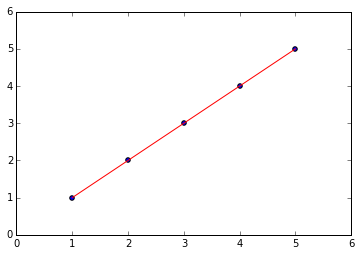
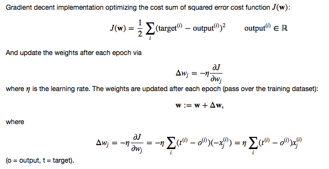
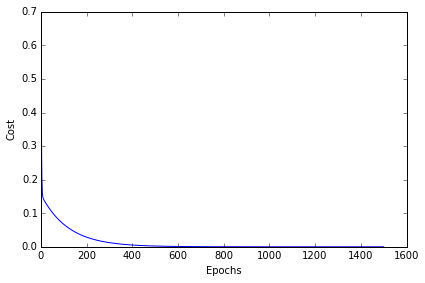
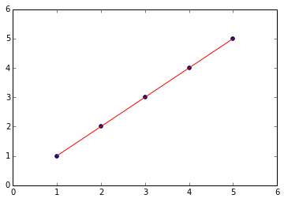

mlxtend
Sebastian Raschka, last updated: 06/10/2015

# Linear Regression

> from mlxtend.regression import LinearRegression

Implementation of ordinary least squares regression.

For more usage examples please see the [IPython Notebook](http://nbviewer.ipython.org/github/rasbt/mlxtend/blob/master/docs/examples/regression__linear_regression.ipynb).

### Example 1 - Normal Equation

Fitting a linear regression model

using the closed-form solution (normal equation)
	

	
and the intercept is calculated as

    >>> import numpy as np
	>>> X = np.array([ 1, 2, 3, 4, 5])[:, np.newaxis]
	>>> y = np.array([ 1, 2, 3, 4, 5])

	>>> import matplotlib.pyplot as plt
	>>> def lin_regplot(X, y, model):
    ... 	plt.scatter(X, y, c='blue')
    ... 	plt.plot(X, model.predict(X), color='red')    
    ... 	return
    	
    >>> ne_lr = LinearRegression(solver='normal_equation')
    >>> ne_lr.fit(X, y)
    >>> print('Intercept: %.2f' % ne_lr.w_[0])
    Intercept: 0.00
    >>> print('Slope: %.2f' % ne_lr.w_[1])
    Slope: 1.00
    
    lin_regplot(X, y, ne_lr)
    plt.show()
    

### Example 2 - Gradient Descent

    >>> gd_lr = LinearRegression(solver='gd', eta=0.005, epochs=1500, random_seed=0)
    >>> gd_lr.fit(X, y)
    >>> print('Intercept: %.2f' % gd_lr.w_[0])
    Intercept: 0.00
    >>> print('Slope: %.2f' % gd_lr.w_[1])
    Slope: 1.00
    
Visualizing the cost to check for convergence and plotting the linear model:

    >>> plt.plot(range(1, gd_lr.epochs+1), gd_lr.cost_)
    >>> plt.xlabel('Epochs')
    >>> plt.ylabel('Cost')
    >>> plt.tight_layout()
    >>> plt.show()    
 
 
 
    >>>  lin_regplot(X, y, gd_lr)
    >>>  plt.show()
    
 
 
 
 **Tip**: I you are using gradient descent, consider standardizing the variables for better convergence of the algorithm.
 
    >>> X_std = (X - np.mean(X)) / X.std()
    >>> y_std = (y - np.mean(y)) / y.std()
    
    >>> gd_lr = LinearRegression(solver='gd', eta=0.1, epochs=10, random_seed=0)
    >>> gd_lr.fit(X_std, y_std)
    >>> print('Intercept: %.2f' % gd_lr.w_[0])
    Intercept: 0.00
    >>> print('Slope: %.2f' % gd_lr.w_[1])
    Slope: 1.00
    
    

 
### Example 3 - Stochastic Gradient Descent
 
In gradient descent the cost function is minimized based on the complete training data set; stochastic gradient descent updates the weights incrementally after each individual training sample.

    >>> sgd_lr = LinearRegression(solver='sgd', eta=0.1, epochs=10, random_seed=0)
    >>> sgd_lr.fit(X_std, y_std)
    >>> print('Intercept: %.2f' % sgd_lr.w_[0])
    Intercept: 0.00
    >>> print('Slope: %.2f' % sgd_lr.w_[1])
    Slope: 1.00
 
    >>> plt.plot(range(1, sgd_lr.epochs+1), sgd_lr.cost_)
    >>> plt.xlabel('Epochs')
    >>> plt.ylabel('Cost')
    >>> plt.tight_layout()
    >>> plt.show()

 

   

### Default Parameters

<pre>    class LinearRegression(object):
        """ Ordinary least squares linear regression.

        Parameters
        ------------
    
        solver : {'gd', 'sgd', 'normal_equation'} (default: 'normal_equation')
          Method for solving the cost function. 'gd' for gradient descent, 
          'sgd' for stochastic gradient descent, or 'normal_equation' (default)
          to solve the cost function analytically.
    
        eta : float (default: 0.1)
          Learning rate (between 0.0 and 1.0); 
          ignored if solver='normal_equation'.

        epochs : int (default: 50)
          Passes over the training dataset; 
          ignored if solver='normal_equation'.

        shuffle : bool (default: False)
            Shuffles training data every epoch if True to prevent circles;
            ignored if solver='normal_equation'.

        random_seed : int (default: None)
            Set random state for shuffling and initializing the weights;
            ignored if solver='normal_equation'.

        zero_init_weight : bool (default: False)
            If True, weights are initialized to zero instead of small random
            numbers in the interval [0,1];
            ignored if solver='normal_equation'

        Attributes
        -----------
        w_ : 1d-array
          Weights after fitting.

        cost_ : list
          Sum of squared errors after each epoch;
          ignored if solver='normal_equation'

        """</pre>

### Methods

<pre>    def fit(self, X, y, init_weights=True):
        """ Fit training data.

        Parameters
        ----------
        X : {array-like, sparse matrix}, shape = [n_samples, n_features]
            Training vectors, where n_samples is the number of samples and
            n_features is the number of features.

        y : array-like, shape = [n_samples]
            Target values.

        init_weights : bool (default: True)
            (Re)initializes weights to small random floats if True.

        Returns
        -------
        self : object
        """</pre>

<pre>    def predict(self, X):
        """
        Predict target values for X.

        Parameters
        ----------
        X : {array-like, sparse matrix}, shape = [n_samples, n_features]
            Training vectors, where n_samples is the number of samples and
            n_features is the number of features.

        Returns
        ----------
        float : Predicted target value.

        """</pre>

