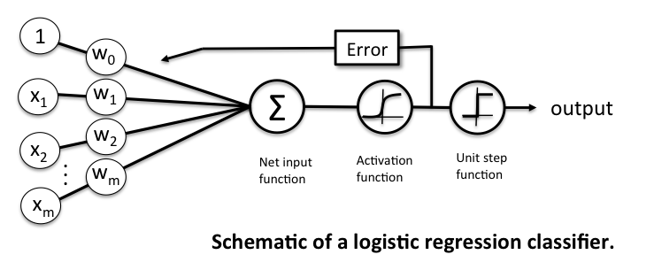
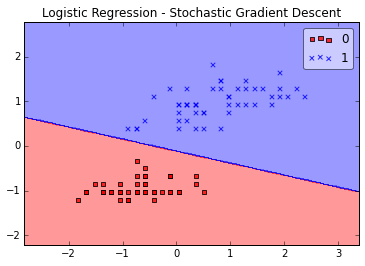

# Classifier

Algorithms for classification.

The `classifier` functions can be imported via

	from mxtend.classifier import ...
	

# Perceptron

Implementation of a Perceptron (single-layer artificial neural network) using the Rosenblatt Perceptron Rule [1].

[1] F. Rosenblatt. The perceptron, a perceiving and recognizing automaton Project Para. Cornell Aeronautical Laboratory, 1957.

For more usage examples please see the [IPython Notebook](http://nbviewer.ipython.org/github/rasbt/mlxtend/blob/master/docs/examples/classifier_perceptron.ipynb).

A detailed explanation about the perceptron learning algorithm can be found here [Artificial Neurons and Single-Layer Neural Networks
- How Machine Learning Algorithms Work Part 1](http://sebastianraschka.com/Articles/2015_singlelayer_neurons.html).

#### Example

	from mlxtend.data import iris_data
	from mlxtend.evaluate import plot_decision_regions
	from mlxtend.classifier import Perceptron
	import matplotlib.pyplot as plt

	# Loading Data

	X, y = iris_data()
	X = X[:, [0, 3]] # sepal length and petal width
	X = X[0:100] # class 0 and class 1
	y = y[0:100] # class 0 and class 1

	# standardize
	X[:,0] = (X[:,0] - X[:,0].mean()) / X[:,0].std()
	X[:,1] = (X[:,1] - X[:,1].mean()) / X[:,1].std()

	# Rosenblatt Perceptron

	ppn = Perceptron(epochs=15, eta=0.01, random_seed=1)
	ppn.fit(X, y)

	plot_decision_regions(X, y, clf=ppn)
	plt.title('Perceptron - Rosenblatt Perceptron Rule')
	plt.show()

	print(ppn.w_)

	plt.plot(range(len(ppn.cost_)), ppn.cost_)
	plt.xlabel('Iterations')
	plt.ylabel('Missclassifications')
	plt.show()

# Adaline

Implementation of Adaline (Adaptive Linear Neuron; a single-layer artificial neural network) using the Widrow-Hoff delta rule. [2].

[2] B. Widrow, M. E. Hoff, et al. Adaptive switching circuits. 1960.

For more usage examples please see the [IPython Notebook](http://nbviewer.ipython.org/github/rasbt/mlxtend/blob/master/docs/examples/classifier_adaline.ipynb).

A detailed explanation about the Adeline learning algorithm can be found here [Artificial Neurons and Single-Layer Neural Networks
- How Machine Learning Algorithms Work Part 1](http://sebastianraschka.com/Articles/2015_singlelayer_neurons.html).

### Example

	from mlxtend.data import iris_data
	from mlxtend.evaluate import plot_decision_regions
	from mlxtend.classifier import Adeline
	import matplotlib.pyplot as plt

	# Loading Data

	X, y = iris_data()
	X = X[:, [0, 3]] # sepal length and petal width
	X = X[0:100] # class 0 and class 1
	y = y[0:100] # class 0 and class 1

	# standardize
	X[:,0] = (X[:,0] - X[:,0].mean()) / X[:,0].std()
	X[:,1] = (X[:,1] - X[:,1].mean()) / X[:,1].std()

	ada = Adaline(epochs=30, eta=0.01, learning='sgd', random_seed=1)
	ada.fit(X, y)
	plot_decision_regions(X, y, clf=ada)
	plt.title('Adaline - Stochastic Gradient Descent')
	plt.show()

	plt.plot(range(len(ada.cost_)), ada.cost_, marker='o')
	plt.xlabel('Iterations')
	plt.ylabel('Cost')
	plt.show()

# Logistic Regression

[[back to top](#overview)]

Implementation of Logistic Regression  with different learning rules: Gradient descent and stochastic gradient descent.

For more usage examples please see the [IPython Notebook](http://nbviewer.ipython.org/github/rasbt/mlxtend/blob/master/docs/examples/classifier_logistic_regression.ipynb).

A more detailed article about the algorithms is in preparation.

### Example

	from mlxtend.data import iris_data
	from mlxtend.evaluate import plot_decision_regions
	from mlxtend.classifier import LogisticRegression
	import matplotlib.pyplot as plt

	# Loading Data

	X, y = iris_data()
	X = X[:, [0, 3]] # sepal length and petal width
	X = X[0:100] # class 0 and class 1
	y = y[0:100] # class 0 and class 1

	# standardize
	X[:,0] = (X[:,0] - X[:,0].mean()) / X[:,0].std()
	X[:,1] = (X[:,1] - X[:,1].mean()) / X[:,1].std()

	lr = LogisticRegression(eta=0.01, epochs=100, learning='sgd')
	lr.fit(X, y)

	plot_decision_regions(X, y, clf=lr)
	plt.title('Logistic Regression - Stochastic Gradient Descent')
	plt.show()

	print(lr.w_)

	plt.plot(range(len(lr.cost_)), lr.cost_)
	plt.xlabel('Iterations')
	plt.ylabel('Missclassifications')
	plt.show()

