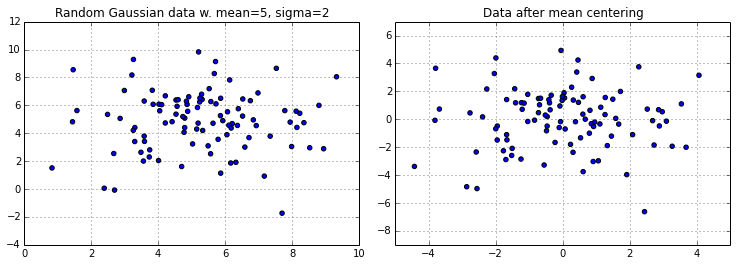

#Preprocessing

A collection of different functions for various data preprocessing procedures.

The `preprocessing utilities` can be imported via

	from mxtend.preprocessing import ...
	

# MeanCenterer

A transformer class that performs column-based mean centering on a NumPy array.

###Example

Use the `fit` method to fit the column means of a dataset (e.g., the training dataset) to a new `MeanCenterer` object. Then, call the `transform` method on the same dataset to center it at the sample mean.

	>>> from mlxtend.preprocessing import MeanCenterer
	>>> X_train
	array([[1, 2, 3],
       [4, 5, 6],
       [7, 8, 9]])
    >>> mc = MeanCenterer().fit(X_train)
	>>> mc.transform(X_train)
    array([[-3, -3, -3],
       [ 0,  0,  0],
       [ 3,  3,  3]])

 

To use the same parameters that were used to center the training dataset, simply call the `transform` method of the `MeanCenterer` instance on a new dataset (e.g., test dataset).
    
    >>> X_test 
    array([[1, 1, 1],
       [1, 1, 1],
       [1, 1, 1]])
    >>> mc.transform(X_test)  
    array([[-3, -4, -5],
       [-3, -4, -5],
       [-3, -4, -5]])

 

The `MeanCenterer` also supports Python list objects, and the `fit_transform` method allows you to directly fit and center the dataset.

	>>> Z
	[1, 2, 3]
	>>> MeanCenterer().fit_transform(Z)
	array([-1,  0,  1])

 

	import matplotlib.pyplot as plt
	import numpy as np

	X = 2 * np.random.randn(100,2) + 5

	plt.scatter(X[:,0], X[:,1])
	plt.grid()
	plt.title('Random Gaussian data w. mean=5, sigma=2')
	plt.show()

	Y = MeanCenterer.fit_transform(X)
	plt.scatter(Y[:,0], Y[:,1])
	plt.grid()
	plt.title('Data after mean centering')
	plt.show()

# Array Unison Shuffling

A function that shuffles 2 or more NumPy arrays in unison.

    
### Example

	>>> import numpy as np
    >>> from mlxtend.preprocessing import shuffle_arrays_unison
    >>> X1 = np.array([[1, 2, 3], [4, 5, 6], [7, 8, 9]])
    >>> y1 = np.array([1, 2, 3])
    >>> print(X1)
    [[1 2 3]
    [4 5 6]
    [7 8 9]]    
    >>> print(y1)
    [1 2 3]
    >>> X2, y2 = shuffle_arrays_unison(arrays=[X1, y1], random_seed=3)
    >>> print(X2)
    [[4 5 6]
    [1 2 3]
    [7 8 9]]
    >>> print(y1)
    [2 1 3]

