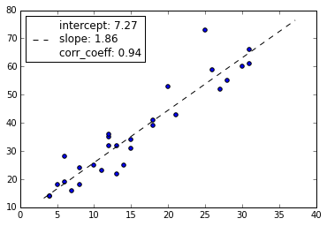

# Regression

The `regression utilities` can be imported via

	from mxtend.text import ...

# Plotting Linear Regression Fits

`lin_regplot` is a function to plot linear regression fits. 
By default `lin_regplot` uses scikit-learn's `linear_model.LinearRegression` to fit the model and SciPy's `stats.pearsonr` to calculate the correlation coefficient. 

**Default parameters:**

	lin_regplot(X, y, model=LinearRegression(), corr_func=pearsonr, scattercolor='blue', fit_style='k--', legend=True, xlim='auto')

### Example

	import matplotlib.pyplot as plt
	from mlxtend.regression import lin_regplot
	import numpy as np

	X = np.array([4, 8, 13, 26, 31, 10, 8, 30, 18, 12, 20, 5, 28, 18, 6, 31, 12,
       12, 27, 11, 6, 14, 25, 7, 13,4, 15, 21, 15])

	y = np.array([14, 24, 22, 59, 66, 25, 18, 60, 39, 32, 53, 18, 55, 41, 28, 61, 35,
       36, 52, 23, 19, 25, 73, 16, 32, 14, 31, 43, 34])

	intercept, slope, corr_coeff = lin_regplot(X, y,)
	plt.show()

	
