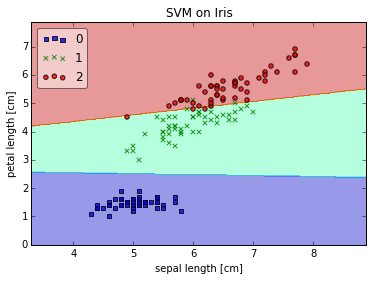
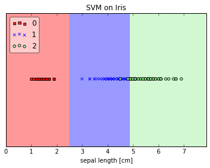
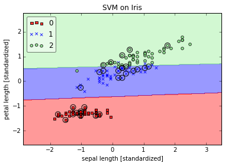

mlxtend  
Sebastian Raschka, last updated: 05/14/2015

# Plotting Decision Regions

> from mlxtend.evaluate import plot_decision_regions

## 2D example

	from mlxtend.evaluate import plot_decision_regions
	import matplotlib.pyplot as plt
	from sklearn import datasets
	from sklearn.svm import SVC

	# Loading some example data
	iris = datasets.load_iris()
	X = iris.data[:, [0,2]]
	y = iris.target

	# Training a classifier
	svm = SVC(C=0.5, kernel='linear')
	svm.fit(X,y)

	# Plotting decision regions
	plot_decision_regions(X, y, clf=svm, res=0.02, legend=2)

	# Adding axes annotations
	plt.xlabel('sepal length [cm]')
	plt.ylabel('petal length [cm]')
	plt.title('SVM on Iris')
	plt.show()

## 1D example

	from mlxtend.evaluate import plot_decision_regions
	import matplotlib.pyplot as plt
	from sklearn import datasets
	from sklearn.svm import SVC

	# Loading some example data
	iris = datasets.load_iris()
	X = iris.data[:, 2]
	X = X[:, None]
	y = iris.target

	# Training a classifier
	svm = SVC(C=0.5, kernel='linear')
	svm.fit(X,y)

	# Plotting decision regions
	plot_decision_regions(X, y, clf=svm, res=0.02, legend=2)

	# Adding axes annotations
	plt.xlabel('sepal length [cm]')
	plt.ylabel('petal length [cm]')
	plt.title('SVM on Iris')
	plt.show()

## Highlighting Test Data Points

Via the `X_highlight`, a second dataset can be provided to highlight particular points in the dataset via a circle.

	from sklearn.cross_validation import train_test_split

	X_train, X_test, y_train, y_test = train_test_split(X, y, test_size=0.20, random_state=0) 

	# Training a classifier
	svm = SVC(C=0.5, kernel='linear')
	svm.fit(X_train, y_train)

	# Plotting decision regions

	plot_decision_regions(X, y, clf=svm, 
                      X_highlight=X_test, 
                      res=0.02, legend=2)

	# Adding axes annotations
	plt.xlabel('sepal length [standardized]')
	plt.ylabel('petal length [standardized]')
	plt.title('SVM on Iris')
	plt.show()

For more examples, please see this [IPython Notebook](http://nbviewer.ipython.org/github/rasbt/mlxtend/blob/master/docs/examples/evaluate_decision_regions.ipynb).

## Default Parameters

<pre>def plot_decision_regions(X, y, clf, X_highlight=None, res=0.02, cycle_marker=True, legend=1, cmap=None):
    """
    Plots decision regions of a classifier.

    Parameters
    ----------
    X : array-like, shape = [n_samples, n_features]
      Feature Matrix.

    y : array-like, shape = [n_samples]
      True class labels.

    clf : Classifier object. Must have a .predict method.

    X_highlight : array-like, shape = [n_samples, n_features] (default: None)
      An array with data points that are used to highlight samples in `X`.

    res : float (default: 0.02)
      Grid width. Lower values increase the resolution but
      slow down the plotting.

    cycle_marker : bool
      Use different marker for each class.

    legend : int
      Integer to specify the legend location.
      No legend if legend is 0.

    cmap : Custom colormap object .

    Returns
    ---------
    None

    Examples
    --------

    from sklearn import datasets
    from sklearn.svm import SVC

    iris = datasets.load_iris()
    X = iris.data[:, [0,2]]
    y = iris.target

    svm = SVC(C=1.0, kernel='linear')
    svm.fit(X,y)

    plot_decision_region(X, y, clf=svm, res=0.02, cycle_marker=True, legend=1)

    plt.xlabel('sepal length [cm]')
    plt.ylabel('petal length [cm]')
    plt.title('SVM on Iris')
    plt.show()

    """</pre>