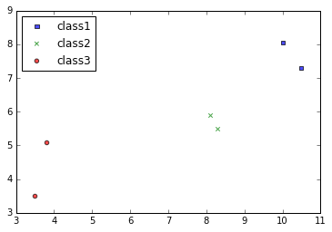
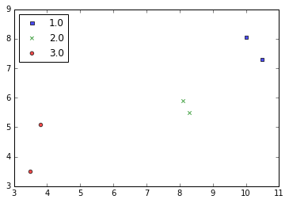

# Scatterplot with Categories

A function to quickly produce a scatter plot colored by categories from a pandas `DataFrame` or NumPy `ndarray` object.

> from mlxtend.general_plotting import category_scatter

# Overview

### References

- -

### Related Topics

- [Enrichment Plot](./enrichment_plot.html)
- [Stacked Barplot](./stacked_barplot.html)

# Examples

## Example 1 - Category Scatter from Pandas DataFrames


```python
import pandas as pd
from io import StringIO

csvfile = """label,x,y
class1,10.0,8.04
class1,10.5,7.30
class2,8.3,5.5
class2,8.1,5.9
class3,3.5,3.5
class3,3.8,5.1"""

df = pd.read_csv(StringIO(csvfile))
df
```


<div>
<table border="1" class="dataframe">
  <thead>
    <tr style="text-align: right;">
      <th></th>
      <th>label</th>
      <th>x</th>
      <th>y</th>
    </tr>
  </thead>
  <tbody>
    <tr>
      <th>0</th>
      <td>class1</td>
      <td>10.0</td>
      <td>8.04</td>
    </tr>
    <tr>
      <th>1</th>
      <td>class1</td>
      <td>10.5</td>
      <td>7.30</td>
    </tr>
    <tr>
      <th>2</th>
      <td>class2</td>
      <td>8.3</td>
      <td>5.50</td>
    </tr>
    <tr>
      <th>3</th>
      <td>class2</td>
      <td>8.1</td>
      <td>5.90</td>
    </tr>
    <tr>
      <th>4</th>
      <td>class3</td>
      <td>3.5</td>
      <td>3.50</td>
    </tr>
    <tr>
      <th>5</th>
      <td>class3</td>
      <td>3.8</td>
      <td>5.10</td>
    </tr>
  </tbody>
</table>
</div>


Plotting the data where the categories are determined by the unique values in the label column `label_col`. The `x` and `y` values are simply the column names of the DataFrame that we want to plot.


```python
%matplotlib inline
import matplotlib.pyplot as plt
from mlxtend.general_plotting import category_scatter

fig = category_scatter(x='x', y='y', label_col='label', data=df, legend_loc='upper left')
```





## Example 2 - Category Scatter from NumPy Arrays


```python
import numpy as np
from io import BytesIO

csvfile = """1,10.0,8.04
1,10.5,7.30
2,8.3,5.5
2,8.1,5.9
3,3.5,3.5
3,3.8,5.1"""

ary = np.genfromtxt(BytesIO(csvfile.encode()), delimiter=',')
ary
```


    array([[  1.  ,  10.  ,   8.04],
           [  1.  ,  10.5 ,   7.3 ],
           [  2.  ,   8.3 ,   5.5 ],
           [  2.  ,   8.1 ,   5.9 ],
           [  3.  ,   3.5 ,   3.5 ],
           [  3.  ,   3.8 ,   5.1 ]])


Now, pretending that the first column represents the labels, and the second and third column represent the `x` and `y` values, respectively.


```python
%matplotlib inline
import matplotlib.pyplot as plt
from mlxtend.general_plotting import category_scatter

fix = category_scatter(x=1, y=2, label_col=0, data=ary, legend_loc='upper left')
```





# API


*category_scatter(x, y, label_col, data, markers='sxo^v', colors=('blue', 'green', 'red', 'purple', 'gray', 'cyan'), alpha=0.7, markersize=20.0, legend_loc='best')*

Scatter plot to plot categories in different colors/markerstyles.

**Parameters**

- `x` : str or int

    DataFrame column name of the x-axis values or
    integer for the numpy ndarray column index.

- `y` : str

    DataFrame column name of the y-axis values or
    integer for the numpy ndarray column index

- `data` : Pandas DataFrame object or NumPy ndarray.


- `markers` : str

    Markers that are cycled through the label category.

- `colors` : tuple

    Colors that are cycled through the label category.

- `alpha` : float (default: 0.7)

    Parameter to control the transparency.

- `markersize` : float (default` : 20.0)

    Parameter to control the marker size.

- `legend_loc` : str (default: 'best')

    Location of the plot legend
    {best, upper left, upper right, lower left, lower right}
    No legend if legend_loc=False

**Returns**

- `fig` : matplotlig.pyplot figure object


