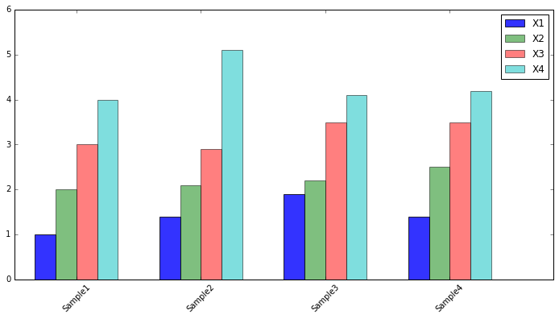

# Stacked Barplot

A function to conveniently plot stacked bar plots in matplotlib using pandas `DataFrame`s. 

> from mlxtend.general_plotting import category_scatter

# Overview

A matplotlib convenience function for creating barplots from DataFrames where each sample is associated with several categories.

### References

- -

# Examples

## Example 1 - Stacked Barplot from Pandas DataFrames


```python
import pandas as pd

s1 = [1.0, 2.0, 3.0, 4.0]
s2 = [1.4, 2.1, 2.9, 5.1]
s3 = [1.9, 2.2, 3.5, 4.1]
s4 = [1.4, 2.5, 3.5, 4.2]
data = [s1, s2, s3, s4]

df = pd.DataFrame(data, columns=['X1', 'X2', 'X3', 'X4'])
df.columns = ['X1', 'X2', 'X3', 'X4']
df.index = ['Sample1', 'Sample2', 'Sample3', 'Sample4']
df
```


<div>
<table border="1" class="dataframe">
  <thead>
    <tr style="text-align: right;">
      <th></th>
      <th>X1</th>
      <th>X2</th>
      <th>X3</th>
      <th>X4</th>
    </tr>
  </thead>
  <tbody>
    <tr>
      <th>Sample1</th>
      <td>1.0</td>
      <td>2.0</td>
      <td>3.0</td>
      <td>4.0</td>
    </tr>
    <tr>
      <th>Sample2</th>
      <td>1.4</td>
      <td>2.1</td>
      <td>2.9</td>
      <td>5.1</td>
    </tr>
    <tr>
      <th>Sample3</th>
      <td>1.9</td>
      <td>2.2</td>
      <td>3.5</td>
      <td>4.1</td>
    </tr>
    <tr>
      <th>Sample4</th>
      <td>1.4</td>
      <td>2.5</td>
      <td>3.5</td>
      <td>4.2</td>
    </tr>
  </tbody>
</table>
</div>


By default, the index of the `DataFrame` is used as column labels, and the `DataFrame` columns are used for the plot legend.


```python
import matplotlib.pyplot as plt
from mlxtend.general_plotting import stacked_barplot

fig = stacked_barplot(df, rotation=45, legend_loc='best')
```





# API


*stacked_barplot(df, bar_width='auto', colors='bgrcky', labels='index', rotation=90, legend_loc='best')*

Function to plot stacked barplots

**Parameters**

- `df` : pandas.DataFrame

    A pandas DataFrame where the index denotes the
    x-axis labels, and the columns contain the different
    measurements for each row.
    bar_width: 'auto' or float (default: 'auto')
    Parameter to set the widths of the bars. if
    'auto', the width is automatically determined by
    the number of columns in the dataset.
    colors: str (default: 'bgrcky')
    The colors of the bars.
    labels: 'index' or iterable (default: 'index')
    If 'index', the DataFrame index will be used as
    x-tick labels.
    rotation: int (default: 90)
    Parameter to rotate the x-axis labels.

- `legend_loc` : str (default: 'best')

    Location of the plot legend
    {best, upper left, upper right, lower left, lower right}
    No legend if legend_loc=False

**Returns**

- `fig` : matplotlib.pyplot figure object


