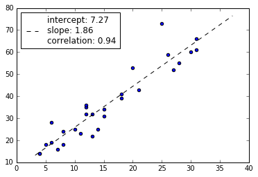

# Linear Regression Plot

A function to plot linear regression fits. 

> from mlxtend.regression_utils import plot_linear_regression

# Overview

The `plot_linear_regression` is a convenience function that uses scikit-learn's `linear_model.LinearRegression` to fit a linear model and SciPy's `stats.pearsonr` to calculate the correlation coefficient. 

### References

- -

### Related Topics

- -

# Examples

## Example 1 - Ordinary Least Squares Simple Linear Regression


```python
import matplotlib.pyplot as plt
from mlxtend.regression_utils import plot_linear_regression
import numpy as np

X = np.array([4, 8, 13, 26, 31, 10, 8, 30, 18, 12, 20, 5, 28, 18, 6, 31, 12,
   12, 27, 11, 6, 14, 25, 7, 13,4, 15, 21, 15])

y = np.array([14, 24, 22, 59, 66, 25, 18, 60, 39, 32, 53, 18, 55, 41, 28, 61, 35,
   36, 52, 23, 19, 25, 73, 16, 32, 14, 31, 43, 34])

intercept, slope, corr_coeff = plot_linear_regression(X, y)
plt.show()
```





# API


*plot_linear_regression(X, y, model=LinearRegression(copy_X=True, fit_intercept=True, n_jobs=1, normalize=False), corr_func='pearsonr', scattercolor='blue', fit_style='k--', legend=True, xlim='auto')*

Plot a linear regression line fit.

**Parameters**

- `X` : numpy array, shape = [n_samples,]

    Samples.

- `y` : numpy array, shape (n_samples,)

    Target values
    model: object (default: sklearn.linear_model.LinearRegression)
    Estimator object for regression. Must implement
    a .fit() and .predict() method.
    corr_func: str or function (default: 'pearsonr')
    Uses `pearsonr` from scipy.stats if corr_func='pearsonr'.
    to compute the regression slope. If not 'pearsonr', the `corr_func`,
    the `corr_func` parameter expects a function of the form
    func(<x-array>, <y-array>) as inputs, which is expected to return
    a tuple `(<correlation_coefficient>, <some_unused_value>)`.
    scattercolor: string (default: blue)
    Color of scatter plot points.
    fit_style: string (default: k--)
    Style for the line fit.
    legend: bool (default: True)
    Plots legend with corr_coeff coef.,
    fit coef., and intercept values.
    xlim: array-like (x_min, x_max) or 'auto' (default: 'auto')
    X-axis limits for the linear line fit.

**Returns**

- `regression_fit` : tuple

    intercept, slope, corr_coeff (float, float, float)


